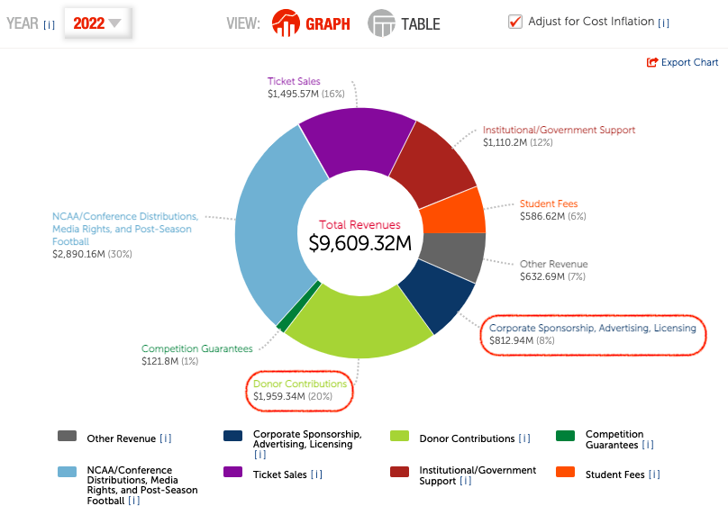

```{r setup, include=FALSE}
knitr::opts_chunk$set(echo = FALSE)
```

class: title-slide   

# The impact of NIL on donor and sponsor revenue of U.S. college athletic departments.

## HES Proposal Presentation

### Saryu Onishi

---
# Background
Provide an overview of the problem that this proposal addresses.
## History of Name, Image and Likeness (NIL)
Does the NCAA's amateurism rules violate antitrust laws?
- **2014:** O'Bannon v. NCAA
 - First major challenge to NCAA's amateurism rules
- **2019:** Fair Pay to Play Act passed in CA
 - Planned to take effect in 2023
- **2021:** NCAA v. Alston
 - Breakthrough case

???
<!--presenter notes -->
obannon:
- argument
- outcome:

fairpay:
- argument: allow students to recieve sponsorship/endorsements while maintaining NCAA eligibility
- outcome: in effect, 2023, many states followed

alston:
- argument: could lead to "pay-for-play" (NCAA) - rejected by courts
- outcome: 
---
# Background - continued
## College Athletic Department Revenue
.pull-left[

<small>Example of Revenue breakdown (FBS, 2022)</small>

]

.pull-right[
Donor and Sponsor revenue in 2022 was approximately:
- 30% of total revenue
- $ 2.8 Billion
]

---

# Purpose of the Study
Purpose of the study:
- Investigate the impact of NIL policy changes on the sponsor and donor revenue of university athletics departments.

Potential impact:
- text
---

# Research Questions

1. Has the introduction of NIL compensation in college sports impacted the sponsorship and donation revenue streams of university athletics departments in the United States?

  - How has the sponsorship and donation revenue streams of university athletics departments in the United States changes after the implementation of NIL policies?
  - How does the changes in sponsorship and donation revenue of university athletics departments compare with the changes sponsorship and donation revenue of professional leagues?
  
---
# Considerations
## Delimitations
1. Data source
2. Football Bowl Subdivision (FBS) institution

## Limitations
1. Secondary data
2. COVID

## Assumptions
1. Budget constraint exist

???
<!--presenter notes -->
delimitation:
1. recent data required, only a few resources for that
 - avoid pay wall - even fewer
 - keep constant - use one
2. sponsor and donor revenue for FCS = 12% in 2022; or approx $155M

limitation:
1. validity (maintained by credible source)
2. some proxy measure of sponsorship spending in pro sports can be used as control

Assumption:
1. zero sum game - this theory will be tested
---

# Operational Definitions
Define any key terms used in the study.

- Budget Constraint
- Donation:
- Endorsement:
- NIL: 
- Sponsorship:


---

# Literature
## research problem
Review the literature related to the research problem.
- impact of NIL

## research methods
Discuss the literature related to the research methods that will be used.
- regression

## sample
Describe the sample that will be used in the study.
-   

---

# Research Designs

- potential threat to validity

-   Discuss potential threats to validity and how they will be addressed.

---

# Methods
## data sources
-   Describe the data sources that will be used in the study.

## data collection

-   Explain how the data will be collected.

---

# Data Analysis

-   Describe the methods that will be used to analyze the data.
